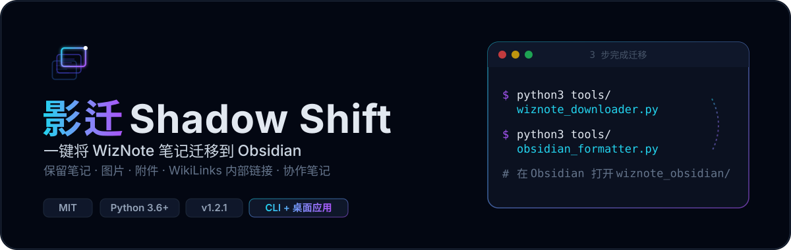
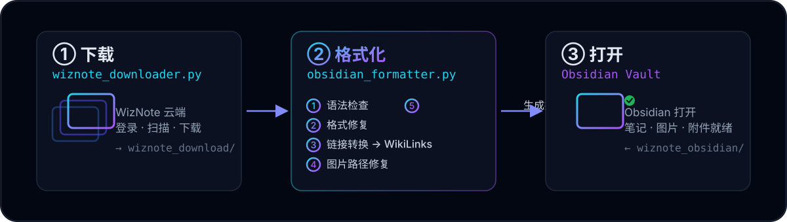

<p align="center">
  
</p>

<p align="center">
  <a href="LICENSE"></a>
  <a href="CHANGELOG.md"></a>
  <a href="https://www.python.org/"></a>
  
</p>

> **影迁 Shadow Shift** —— 一键将 WizNote 笔记迁移到 Obsidian，保留笔记、图片、附件与 WikiLinks 内部链接。
>
> 📖 [快速参考指南](QUICK_REFERENCE.md) · 📚 [文档索引](DOCUMENTATION_INDEX.md) · 📝 [更新日志](CHANGELOG.md)

---

<p align="center">
  
</p>

## 为什么用它

- **一键迁移**：两条命令完成 WizNote → Obsidian，99% 用户只需默认流程。
- **格式完整**：自动执行 5 步格式化 —— 语法检查 → 格式修复 → 链接转换（WikiLinks）→ 图片修复 → 生成报告。
- **数据无损**：原始 `wiznote_download/` 只读不变，格式化结果写入独立的 `wiznote_obsidian/`。
- **零额外依赖（离线）**：格式化工具纯 Python 3.6+ 实现；仅在线下载需 `requests` / `markdownify` / `websocket-client`。
- **实测规模**：单次迁移 449 篇笔记、7198 张图片、30 个附件。

## 快速开始

```bash
# 1. 克隆
git clone https://github.com/WardLu/wiznote-to-obsidian.git
cd wiznote-to-obsidian
pip3 install -r requirements.txt        # 仅在线下载需要

# 2. 下载笔记（输入 WizNote 账号密码）
python3 tools/wiznote_downloader.py

# 3. 格式化（基础 5 步）
python3 tools/obsidian_formatter.py

# 4. 在 Obsidian 中打开 wiznote_obsidian 目录
```

就这么简单。需要附件集中管理时，把第 3 步换成 `python3 tools/obsidian_formatter.py --all`（7 步）。

| 目录 | 说明 | 是否修改 |
| --- | --- | --- |
| `wiznote_download/` | 原始下载笔记 | 只读，保持不变 |
| `wiznote_obsidian/` | 格式化后笔记 | 在 Obsidian 中打开此目录 |

## 命令速查

| 命令 | 作用 | 步骤 |
| --- | --- | --- |
| `python3 tools/wiznote_downloader.py` | 在线下载 WizNote 笔记 | 登录 · 扫描 · 下载 · 转 Markdown |
| `python3 tools/obsidian_formatter.py` | 离线格式化（默认） | 5 步：语法 / 格式 / 链接 / 图片 / 报告 |
| `python3 tools/obsidian_formatter.py --all` | 完整迁移 | 7 步：5 步 + 附件迁移 + 附件链接 |

**单步命令**（只执行某一阶段）：

```bash
python3 tools/obsidian_formatter.py --check     # 只检查语法（不修改）
python3 tools/obsidian_formatter.py --fix       # 只修复格式
python3 tools/obsidian_formatter.py --links     # 只转换链接为 WikiLinks
python3 tools/obsidian_formatter.py --images    # 只修复图片路径
python3 tools/obsidian_formatter.py --report    # 只生成报告
python3 tools/obsidian_formatter.py --fix --dry-run   # 干运行预览
```

**下载参数**（网络环境调节）：

```bash
python3 tools/wiznote_downloader.py --workers 10 --timeout 20   # 极速模式
python3 tools/wiznote_downloader.py --workers 3 --timeout 10 --retries 1  # 安全模式
```

## 核心工具

| 工具 | 用途 | 依赖 |
| --- | --- | --- |
| `tools/wiznote_downloader.py` | 从 WizNote 云端下载笔记 | 需在线依赖 |
| `tools/obsidian_formatter.py` | 离线格式化为 Obsidian 规范 | 纯 Python，无依赖 |
| `tools/sync_deletions.py` | 安全同步两目录删除（含干运行、备份、日志） | 无 |
| `tools/config_helper.py` | 配置管理（环境变量 / JSON），供其他工具调用 | 无 |

<details>
<summary><b>五步格式化详解</b></summary>

1. **语法检查** — 标题空格、层级跳跃、列表格式、代码块语言标识
2. **格式修复** — 标题空格、统一列表标记（`-`）、空行、多余空格
3. **链接转换** — `[文本](URL)` → `[[笔记名]]`，转换 WizNote 内部链接与附件链接
4. **图片修复** — 统一路径格式、修复相对路径
5. **生成报告** — 统计 Markdown 文件数、WikiLinks 数

</details>

<details>
<summary><b>sync_deletions.py 使用流程</b></summary>

```bash
# 1. 扫描差异（只查看，不删除）
python3 tools/sync_deletions.py --scan --source ~/wiznote_export --target ~/ObsidianVault
# 2. 查看报告确认
# 3. 确认删除（备份到 .sync_delete_trash/）
python3 tools/sync_deletions.py --confirm --source ~/wiznote_export --target ~/ObsidianVault
```

</details>

## 常见问题

<details>
<summary><b>Q1：登录后出现 <code>None/ks/...</code> 或无法获取目录？</b></summary>

通常表示登录未真正成功。若账号启用二次登录验证，请先在 **WizNote X 或网页版**关闭二次验证后重试（经典版客户端无关闭选项）。

</details>

<details>
<summary><b>Q2：默认命令和 <code>--all</code> 的区别？</b></summary>

- **默认**（5 步）：图片保持在 `*_files/` 目录，大多数用户足够。
- **`--all`**（7 步）：额外把附件迁移到 `attachments/` 并添加链接，适合长期使用 Obsidian、想集中管理附件的用户。

</details>

<details>
<summary><b>Q3：源目录不在项目根目录怎么办？</b></summary>

```bash
python3 tools/obsidian_formatter.py --source /path/to/wiznote_export --target /path/to/wiznote_obsidian
# 或用环境变量
export WIZNOTE_SOURCE_DIR=~/wiznote_export
```

</details>

## 已知局限

- **API 速率限制**：WizNote API 可能限流，默认 5 线程；网络差用安全模式参数。
- **加密笔记**：RSA + AES 混合加密，需在 WizNote 客户端批量解密后再运行。
- **HTML → Markdown**：复杂表格、嵌套列表、`<iframe>` 等转换可能不完美，建议下载后用格式化工具优化。
- **服务可用性**：WizNote 服务器维护时无法下载，建议错峰。

完整局限与最佳实践见 [QUICK_REFERENCE.md](QUICK_REFERENCE.md)。

## 项目架构

本项目采用 **开源工具 + 商业应用** 双轨架构：

- **开源部分**：本仓库 `tools/` 目录，命令行工具，完全免费（MIT）。
- **商业部分**：`app/` 目录（Git Submodule [`shadow-shift`](https://github.com/WardLu/shadow-shift)），图形界面桌面应用。

| 你的身份 | 推荐 |
| --- | --- |
| 技术用户 | 本仓库命令行工具 |
| 非技术用户 | 商业桌面应用（图形界面） |

## 贡献

欢迎贡献代码、报告问题或提出建议 —— 提交 [GitHub Issue](https://github.com/WardLu/wiznote-to-obsidian/issues)。

## 许可证

[MIT License](LICENSE)

## 联系我

- **X (Twitter)**：[@Gollumgulu](https://x.com/Gollumgulu)
- **微信公众号**：Ward的AI产品实战
  
- **小红书 / 微博 / 抖音**：全网同名 `Ward的AI产品实战` · [小红书](https://xhslink.cn/m/4W1NWyRrxv5) · [微博](https://weibo.com/u/8344390431) · [抖音](https://v.douyin.com/1y06PMohfoE/)
- **个人主页**：全力开发中...
- **产品主页**：[Shadow Nexus](https://www.shadow.wang/)
- **Email**：[wardlu@126.com](mailto:wardlu@126.com)

> 可接 1v1 咨询和项目陪跑，欢迎联系。

---

<p align="center">
  如果这个项目对你有帮助，请给一个 ⭐ Star！
</p>
