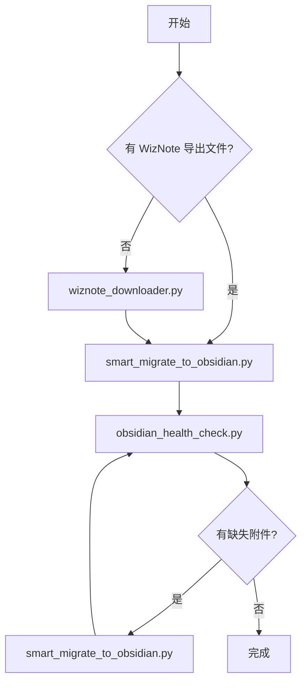

# Tools 目录

> **版本**: v1.2.0 | 所有迁移工具和辅助脚本

## 📁 目录结构

```
tools/
│
│  ── 迁移工具（WizNote → Obsidian）──
│
├── 📥 wiznote_downloader.py              # 从 WizNote 云端下载笔记
├── 🚀 smart_migrate_to_obsidian.py       # 智能迁移工具（推荐）⭐
├── 🔧 obsidian_formatter.py              # 格式化工具
├── 🔧 fix_wiznote_source_files.py        # 源文件修复（Typora 兼容）
├── 🔗 integrate_missing_attachments.py   # 整合缺失附件
├── 🛠️  migrate_manual_notes.py          # 手动迁移特定笔记
├── 🔄 remigrate_single_note.py           # 重新迁移单个笔记
├── 📂 move_note_to_correct_path.py       # 移动笔记到正确路径
│
│  ── 迁移检查（验证迁移结果）──
│
├── 🔍 check_attachment_migration.py      # 附件迁移完整性检查
├── 🔍 check_attachment_migration_fixed.py # 附件迁移检查（修复版）
├── 🔍 check_attachments_final.py         # 附件完整性最终检查
├── 📊 compare_migration.py               # 迁移结果对比
├── 🔍 diagnose_missing_notes.py          # 缺失笔记诊断
│
│  ── 仓库维护（Obsidian 日常清理）──
│
├── 📦 consolidate_attachments.py         # 散落资源整合 ⭐
├── 🧹 vault_cleaner.py                  # 仓库清理（去重 + 近似重复 + 空内容 + 孤儿文件 + 引用修复）⭐
├── 🏥 obsidian_health_check.py           # 健康检查 ⭐
├── 🔍 scan_wikilinks.py                  # WikiLink 扫描
├── 🗑️  sync_deletions.py                # 同步删除
├── ⚙️  config_helper.py                 # 配置管理模块（被其他工具调用）
│
└── 📁 archive/                           # 归档工具
```

## 🚀 快速开始

### 场景 1：从 WizNote 云端下载并迁移（推荐新手）

```bash
# 1. 从 WizNote 云端下载笔记
python3 tools/wiznote_downloader.py
# 输入 WizNote 账号和密码

# 2. 智能迁移到 Obsidian
python3 tools/smart_migrate_to_obsidian.py
```

### 场景 2：已有 WizNote 导出文件

```bash
# 直接运行智能迁移
python3 tools/smart_migrate_to_obsidian.py
```

### 场景 3：检查仓库健康度

```bash
# 健康检查（包含附件检查、重复内容检查等）
python3 tools/obsidian_health_check.py
```

## 📥 迁移工具（WizNote → Obsidian）

### 1. wiznote_downloader.py（在线下载工具）

**作用**：从 WizNote 云端下载笔记并转换为 Markdown

**使用场景**：还没有导出 WizNote 笔记

**功能**：
- 直接登录 WizNote 云端
- 递归扫描所有文件夹
- 自动转换 HTML → Markdown
- 下载笔记中的图片和附件
- 支持协作笔记下载（通过 WebSocket 协议）

**输出目录**：`wiznote_download/`（原始下载）

**使用方法**：
```bash
# 使用默认参数（推荐新手）
python3 tools/wiznote_downloader.py

# 极速模式（网络好）
python3 tools/wiznote_downloader.py --workers 10 --timeout 20

# 安全模式（网络差）
python3 tools/wiznote_downloader.py --workers 3 --timeout 10 --retries 1
```

**支持的笔记类型**：
- ✅ HTML 笔记 - 自动转换为 Markdown
- ✅ Lite/Markdown 笔记 - 直接保存原格式
- ✅ 协作笔记 - 通过 ShareJS 协议自动获取并转换
- ⚠️ 加密笔记 - 检测提醒，需要先在客户端解密
- ✅ 图片/附件 - 下载到 `_files/` 目录

### 2. smart_migrate_to_obsidian.py（智能迁移工具）⭐ 推荐

**作用**：智能迁移 WizNote 笔记到 Obsidian，支持 WikiLink 格式

**使用场景**：90% 的迁移场景都使用这个工具

**功能**：
- ✅ 自动检测并迁移笔记
- ✅ 支持标准 Markdown 链接 `[text](path)`
- ✅ **支持 WikiLink 格式** `[[path|text]]`（新增）
- ✅ 自动转换 WikiLink → Markdown 链接
- ✅ 迁移所有附件（.xmind, .pdf, .doc 等）
- ✅ 完整性检查
- ✅ 生成详细报告

**使用方法**：
```bash
# 执行智能迁移
python3 tools/smart_migrate_to_obsidian.py
```

**特性**：
- 自动跳过已完整迁移的笔记
- 检测缺失的附件并自动修复
- 生成迁移报告
- 保留原始 WizNote 文件不变

**输出示例**：
```
📝 处理笔记: 增值付费项目.md
  ⚠️  需要迁移: 缺失 1 个 WikiLink 附件
  🖼️  图片链接: 1 个
  📎 WikiLink 附件链接: 1 个
  ✅ 复制图片: 1/1 个
  ✅ 复制 WikiLink 附件: 1/1 个
  ✅ 更新目标笔记
```

### 3. scan_wikilinks.py（WikiLink 扫描工具）

**作用**：扫描 WizNote 文件中的 WikiLink 链接

**使用场景**：检查哪些笔记使用了 WikiLink 格式的附件

**功能**：
- 扫描所有 WikiLink 格式的链接
- 按文件类型统计
- 检测文件是否存在
- 生成详细报告

**使用方法**：
```bash
# 扫描所有 WizNote 文件
python3 tools/scan_wikilinks.py
```

**输出**：
- `wikilink_scan_results.json` - 详细扫描结果

### 4. obsidian_health_check.py（健康检查工具）⭐ 推荐

**作用**：全面检查 Obsidian 仓库的健康状态

**使用场景**：检查附件完整性、重复内容、文件结构等

**功能**：
- ✅ 检查附件完整性（图片、PDF、附件）
- ✅ 检查重复内容（文件级别）
- ✅ 检查重复文件名
- ✅ 检查内容过少的文件
- ✅ 检查文件结构
- ✅ 生成健康度评分（0-100）
- ✅ 生成详细报告

**使用方法**：
```bash
# 完整检查
python3 tools/obsidian_health_check.py

# 快速检查（只检查附件）
python3 tools/obsidian_health_check.py --quick
```

**输出示例**：
```
📊 总体健康度: 100/100 🌟🌟🌟🌟🌟

✅ 良好指标
- ✅ 100.0% 附件使用 WikiLink 格式
- ✅ 0 个重复文件
- ✅ 0 个空文件

⚠️ 需要关注
- ⚠️  5 个重复的文件名
- ⚠️  23 个内容过少的文件
```

**整合说明**：此工具整合了以下已归档工具的功能：
- `check_duplicate_content.py` - 重复内容检查
- `obsidian_health_check.py` - 健康检查（含附件完整性）

### 5. obsidian_formatter.py（格式化工具）

**作用**：一体化格式化工具

**使用场景**：需要精细控制迁移流程时使用

**功能**：
- 语法检查
- 格式修复
- 链接转换
- 图片修复
- 附件迁移
- 附件链接
- 生成报告

**注意**：大多数情况下，推荐使用 `smart_migrate_to_obsidian.py`

**使用方法**：
```bash
# 基础迁移（5步）
python3 tools/obsidian_formatter.py

# 完整迁移（7步，包含附件）
python3 tools/obsidian_formatter.py --all

# 只检查语法
python3 tools/obsidian_formatter.py --check

# 干运行模式（预览）
python3 tools/obsidian_formatter.py --fix --dry-run
```

### 6. sync_deletions.py（同步删除工具）

**作用**：安全地同步两个目录的删除操作

**使用场景**：在 WizNote 中删除笔记后同步到 Obsidian

**安全特性**：
- 必须人工确认
- 执行前显示完整清单
- 生成删除日志
- 支持干运行模式

**使用方法**：
```bash
# 扫描差异（只查看）
python3 tools/sync_deletions.py --scan \
  --source wiznote_obsidian \
  --target ~/ObsidianVault

# 确认删除
python3 tools/sync_deletions.py --confirm \
  --source wiznote_obsidian \
  --target ~/ObsidianVault
```

## 🧹 仓库维护工具

### 7. consolidate_attachments.py（散落资源整合工具）

**作用**：将散落的 `*_files` 和 `attachments` 目录统一归档到顶层 `attachments/`

**使用场景**：Obsidian 仓库中有大量散落的资源目录，侧边栏杂乱，需要统一整理

**功能**：
- ✅ 扫描所有散落的 `*_files`、`attachments`、`images` 目录
- ✅ 移动文件到顶层 `attachments/`（同名同内容自动跳过，内容不同加后缀）
- ✅ 更新所有 Markdown 中的引用路径（支持 `` 和 `[[]]` 两种语法）
- ✅ 清理迁移后变空的旧目录

**三种模式**：

| 模式 | 说明 |
|------|------|
| `scan` | 仅扫描并报告，不做任何修改 |
| `dry-run` | 模拟迁移，显示将要执行的操作 |
| `migrate` | 执行迁移：移动文件 → 更新引用 → 清理空目录 |

**使用方法**：
```bash
# 1. 先扫描，看有哪些散落的资源目录
python3 tools/consolidate_attachments.py scan /path/to/vault

# 2. 模拟迁移，确认操作无误
python3 tools/consolidate_attachments.py dry-run /path/to/vault

# 3. 执行迁移（会提示确认）
python3 tools/consolidate_attachments.py migrate /path/to/vault
```

**注意**：
- 迁移前建议先用 `scan` 或 `dry-run` 确认
- 迁移后在 Obsidian 设置中配置 `Settings → Files and Links → Default location for new attachments → attachments`，之后粘贴的图片自动归档

### 8. vault_cleaner.py（仓库清理工具）

**作用**：检测并清理重复文件、近似重复笔记、孤儿文件，并修复失效引用

**使用场景**：仓库中有大量重复资源、近似重复笔记或未被引用的孤儿文件

**五种模式**：

| 模式 | 说明 |
|------|------|
| `dedup` | 按内容哈希检测重复文件，每组保留一个，删除其余并更新引用 |
| `fuzzy` | 检测近似重复笔记（按标题+纯文本比对，显示相似度百分比，支持 `--threshold` 调整阈值） |
| `clean` | 检测并清理空笔记和空目录，支持 `--fix-untitled` 清理「无标题」占位符 |
| `orphan` | 检测未被任何笔记引用的资源文件（孤儿文件） |
| `fix` | 修复失效引用，将孤儿文件重新链接到笔记 |

**使用方法**：
```bash
# 修复失效引用
python3 tools/vault_cleaner.py fix /path/to/vault
python3 tools/vault_cleaner.py fix /path/to/vault --apply

# 近似重复笔记清理（带引用重定向）
python3 tools/vault_cleaner.py fuzzy /path/to/vault
python3 tools/vault_cleaner.py fuzzy /path/to/vault --apply
python3 tools/vault_cleaner.py fuzzy /path/to/vault --threshold 0.25 --apply  # 降低阈值检测更多

# 文件去重（带引用更新）
python3 tools/vault_cleaner.py dedup /path/to/vault
python3 tools/vault_cleaner.py dedup /path/to/vault --apply

# 孤儿文件清理（默认排除 .pdf .xls .xlsx .xmind）
python3 tools/vault_cleaner.py orphan /path/to/vault
python3 tools/vault_cleaner.py orphan /path/to/vault --apply

# 空笔记/空目录清理 + 「无标题」占位符
python3 tools/vault_cleaner.py clean /path/to/vault --fix-untitled
python3 tools/vault_cleaner.py clean /path/to/vault --fix-untitled --apply
```

**推荐流程**：`fix` → `fuzzy` → `dedup` → `orphan` → `clean`

**fuzzy 模式说明**：
- 默认阈值 0.8（80% 相似度），可通过 `--threshold` 调整
- 账号密码类笔记内容少，建议降低阈值（如 0.25）
- 文件名含 `template`、`模板`、`tpl` 的笔记自动保护，不会被删除
- 代码块内容保留比较（不删除代码块内的差异）

**引用安全**：
- `dedup`：删除前更新所有指向被删文件的引用（Markdown/WikiLink/HTML）
- `fuzzy`：删除前把 `[[被删笔记标题]]` 重定向到保留笔记
- `orphan`：按绝对路径+文件名双重匹配，仅删除真正无引用的文件

**配置**：清理相关的目录名、排除扩展名、模板保护关键词等可通过 `config.json` 的 `cleanup` 节点配置，详见 `config.example.json`。命令行参数优先级高于配置文件。

**默认排除**：`orphan` 模式默认排除 `.pdf`、`.xls`、`.xlsx`、`.xmind`，可通过 `--exclude-ext` 覆盖。

**注意**：默认仅预览，加 `--apply` 才实际修改。

---

## 🔧 迁移辅助工具

### 9. fix_wiznote_source_files.py

**作用**：修复 WizNote 源文件中的 WikiLink，转换为标准 Markdown 格式

**使用场景**：确保源文件在 Typora 等标准 Markdown 编辑器中正常显示

```bash
python3 tools/fix_wiznote_source_files.py
```

### 10. integrate_missing_attachments.py

**作用**：将"缺失图片及附件笔记"目录中的笔记和附件整合到主目录

```bash
python3 tools/integrate_missing_attachments.py
```

### 11. migrate_manual_notes.py

**作用**：手动迁移特定笔记

**使用场景**：需要手动控制迁移过程时使用

### 12. remigrate_single_note.py

**作用**：重新迁移单个笔记

**使用场景**：某个笔记迁移有问题，需要重新迁移

### 13. move_note_to_correct_path.py

**作用**：移动笔记到正确的路径

## 🔍 迁移检查工具

### 14. check_attachment_migration.py

**作用**：对比源目录和 Obsidian 仓库，检查附件迁移完整性

```bash
python3 tools/check_attachment_migration.py
```

### 15. check_attachment_migration_fixed.py

**作用**：附件迁移检查（修复版，支持 WikiLink）

```bash
python3 tools/check_attachment_migration_fixed.py
```

### 16. check_attachments_final.py

**作用**：最终版附件完整性检查，搜索 7+ 种可能路径

```bash
python3 tools/check_attachments_final.py
```

### 17. compare_migration.py

**作用**：迁移结果对比

```bash
python3 tools/compare_migration.py
```

### 18. diagnose_missing_notes.py

**作用**：缺失笔记诊断

```bash
python3 tools/diagnose_missing_notes.py
```

**使用场景**：笔记路径不符合预期时使用

### 19. config_helper.py

**作用**：配置管理模块

**注意**：不需要直接运行，被其他工具调用

## 📂 归档工具

### archive/v20260228/

**包含工具**：
- `check_duplicate_content.py` - 检查重复内容（已整合到 `obsidian_health_check.py`）
- `check_obsidian_attachments.py` - 检查附件（已整合到 `obsidian_health_check.py`）

**说明**：这些工具的功能已整合到 `obsidian_health_check.py`，提供更全面的健康检查

### archive/diagnosis/

**包含工具**：
- `batch_diagnose_images.py` - 批量诊断图片
- `diagnose_image_download.py` - 诊断单个笔记
- `diagnose_image_issue.py` - 诊断图片问题
- `diagnose_image_loss.py` - 诊断图片丢失
- `deep_api_diagnosis.py` - API 诊断
- `generate_redownload_list.py` - 生成重下载列表

**说明**：这些工具用于诊断图片和资源问题，已被 `scan_wikilinks.py` 和 `obsidian_health_check.py` 取代

### archive/legacy_fixes/

**包含工具**：
- `batch_fix_missing_images.py` - 批量修复图片
- `fix_broken_images.py` - 修复损坏图片
- `fix_missing_resources.py` - 修复缺失资源
- `fix_obsidian_resources.py` - 修复资源
- `restore_missing_images.py` - 恢复缺失图片

**说明**：这些工具已被 `smart_migrate_to_obsidian.py` 取代

### archive/legacy_migration/

**包含工具**：
- `migrate_attachments.py` - 附件迁移（已整合）
- `link_attachments.py` - 附件链接（已整合）
- `process_wiznote_export.py` - 处理导出（已过时）
- `redownload_notes.py` - 重新下载（已过时）
- `selective_redownload.py` - 选择性重下载（已过时）
- `download_images_from_html.py` - 从 HTML 下载图片（已过时）
- `extract_image_urls.py` - 提取图片 URL（已过时）
- `check_migration.py` - 检查迁移（已过时）
- `verify_images.py` - 验证图片（已过时）
- `check_obsidian_resources.py` - 检查资源（已过时）
- `collaboration_note_parser.py` - 协作笔记解析（已整合）
- `generate_accurate_report.py` - 生成报告（已过时）
- `convert_wikilinks_to_markdown.py` - 转换 WikiLink（已整合）

**说明**：这些工具功能已整合到主工具中，不再需要单独使用

### archive/pdf_converters/

**包含工具**：
- `convert_pdf_simple.py` - 简单 PDF 转换
- `convert_pdf_with_images.py` - 带图片转换
- `pdf_to_markdown.py` - PDF 转 Markdown

**说明**：PDF 转换功能已整合到主下载工具中

## ⚙️ 配置说明

### 方式 1：环境变量（推荐）

```bash
export WIZNOTE_SOURCE_DIR=wiznote_download
export WIZNOTE_VAULT_DIR=wiznote_obsidian
export WIZNOTE_ATTACHMENTS_DIR=wiznote_obsidian/attachments
```

### 方式 2：配置文件

```bash
cp config.example.json config.json
# 编辑 config.json
python3 tools/smart_migrate_to_obsidian.py --config config.json
```

`config.json` 支持的配置节：
- `source_dir` / `vault_dir` / `target_dir` — 迁移路径
- `categories` — 笔记分类和标签
- `cleanup` — 清理工具配置（资源目录名、排除扩展名、模板保护等）

### 方式 3：使用默认路径

工具会自动使用以下默认路径：
- `source_dir`: `wiznote_download/`（原始下载）
- `vault_dir`: `wiznote_obsidian/`（格式化输出）
- `attachments_dir`: `wiznote_obsidian/attachments/`

## 📖 详细文档

- [完整工具说明](./tools/README.md)
- [文档索引](./DOCUMENTATION_INDEX.md)

## 🔍 常见问题

**Q: 我应该使用哪个工具？**

A:
- 还没有导出笔记 → 使用 `wiznote_downloader.py`
- 已有导出文件 → 使用 `smart_migrate_to_obsidian.py`（推荐）
- 需要检查附件 → 使用 `scan_wikilinks.py` + `obsidian_health_check.py`

**Q: WikiLink 格式是什么？**

A: WikiLink 是 WizNote 中使用的链接格式：`[[path|text]]` 或 `[[path]]`
- 标准格式：`[text](path)`（Obsidian 兼容）
- WikiLink 格式：`[[path|text]]`（需要转换）
- `smart_migrate_to_obsidian.py` 会自动转换

**Q: 输出目录在哪里？**

A:
- 原始下载：`wiznote_download/`
- 格式化输出：`wiznote_obsidian/`（在 Obsidian 中打开这个）

**Q: 如何查看工具的详细参数？**

A:
```bash
python3 tools/smart_migrate_to_obsidian.py --help
python3 tools/wiznote_downloader.py --help
```

## 📊 工具对比

| 功能 | wiznote_downloader | smart_migrate | fix_source | health_check | scan_wikilinks | consolidate | vault_cleaner |
|------|-------------------|---------------|------------|--------------|----------------|-------------|---------------|
| 下载笔记 | ✅ | ❌ | ❌ | ❌ | ❌ | ❌ | ❌ |
| 迁移笔记 | ❌ | ✅ | ❌ | ❌ | ❌ | ❌ | ❌ |
| 修复源文件 | ❌ | ❌ | ✅ | ❌ | ❌ | ❌ | ❌ |
| 支持 WikiLink | ❌ | ✅ | ✅ | ✅ | ✅ | ✅ | ✅ |
| 检查附件 | ❌ | ✅ | ❌ | ✅ | ❌ | ❌ | ❌ |
| 检查重复 | ❌ | ❌ | ❌ | ✅ | ❌ | ❌ | ✅ |
| 去重删除 | ❌ | ❌ | ❌ | ❌ | ❌ | ❌ | ✅ |
| 近似重复笔记 | ❌ | ❌ | ❌ | ❌ | ❌ | ❌ | ✅ |
| 空笔记/空目录 | ❌ | ❌ | ❌ | ❌ | ❌ | ❌ | ✅ |
| 孤儿文件 | ❌ | ❌ | ❌ | ❌ | ❌ | ❌ | ✅ |
| 修复失效引用 | ❌ | ❌ | ❌ | ❌ | ❌ | ❌ | ✅ |
| 整合散落资源 | ❌ | ❌ | ❌ | ❌ | ❌ | ✅ | ❌ |
| 健康评分 | ❌ | ❌ | ❌ | ✅ | ❌ | ❌ | ❌ |
| 生成报告 | ✅ | ✅ | ✅ | ✅ | ✅ | ✅ | ✅ |

## 🔄 工作流程

### 完整迁移流程



## 💡 最佳实践

1. **首次迁移**：
   - 使用 `wiznote_downloader.py` 下载笔记
   - 使用 `fix_wiznote_source_files.py` 修复源文件（确保在 Typora 中正常显示）
   - 使用 `smart_migrate_to_obsidian.py` 迁移到 Obsidian
   - 使用 `obsidian_health_check.py` 验证

2. **定期检查**：
   - 定期运行 `obsidian_health_check.py` 检查仓库健康度
   - 发现缺失时重新运行 `smart_migrate_to_obsidian.py`

3. **清理归档**：
   - 归档工具保留历史记录，可随时恢复
   - 如需使用归档工具，直接运行即可

## 🆘 故障排除

### 问题 1：附件丢失

**症状**：笔记中的 .xmind、.pdf 等附件找不到

**解决方案**：
```bash
# 1. 健康检查
python3 tools/obsidian_health_check.py

# 2. 重新迁移
python3 tools/smart_migrate_to_obsidian.py
```

### 问题 2：图片缺失

**症状**：笔记中的图片无法显示

**解决方案**：
```bash
# 使用 smart_migrate 自动修复
python3 tools/smart_migrate_to_obsidian.py
```

### 问题 3：源文件图片不显示

**症状**：wiznote_download 中的笔记在 Typora 中图片不显示

**解决方案**：
```bash
# 修复源文件
python3 tools/fix_wiznote_source_files.py
```

### 问题 4：下载失败

**症状**：wiznote_downloader.py 下载失败

**解决方案**：
- 检查网络连接
- 使用安全模式：`--workers 3 --timeout 10`
- 查看错误日志

## 📝 更新日志

### 2026-06-03
- ✅ 新增 `consolidate_attachments.py` - 散落资源整合工具，统一 `*_files`、`attachments`、`images` 到顶层目录
- ✅ 新增 `vault_cleaner.py` - 仓库清理工具（去重 + 近似重复 + 孤儿文件 + 引用修复）
  - `dedup`：按内容哈希去重，自动更新引用
  - `fuzzy`：按标题+纯文本比对近似重复笔记，显示相似度百分比，支持 `--threshold` 调整阈值
  - `orphan`：检测孤儿文件，默认排除 .pdf/.xls/.xlsx/.xmind，预览时列出文件详情
  - `fix`：修复失效引用，将孤儿文件重新链接到笔记
  - 模板保护：文件名含 template/模板/tpl 的笔记不会被 fuzzy 删除
  - 代码块内容保留比较（不删除代码块内的差异）
  - `clean`：检测并清理空笔记和空目录，支持 `--fix-untitled` 清理 WizNote 导出的「无标题」占位符

### 2026-02-28
- ✅ 新增 `fix_wiznote_source_files.py` - 修复源文件格式
- ✅ 新增 `integrate_missing_attachments.py` - 整合缺失附件
- ✅ 新增 `obsidian_health_check.py` - 整合健康检查工具
- ✅ 归档 `check_duplicate_content.py` - 功能已整合
- ✅ 归档 `check_obsidian_attachments.py` - 功能已整合
- ✅ 删除 `fix_wiznote_attachments.py` - 错误方向
- ✅ 更新文档和清理报告

### 2026-02-27
- ✅ 新增 WikiLink 支持
- ✅ 新增 `scan_wikilinks.py` 工具
- ✅ 新增 `check_obsidian_attachments.py` 工具
- ✅ 改进 `smart_migrate_to_obsidian.py`
- ✅ 清理过时工具到 `archive/` 目录
- ✅ 更新文档

### 历史版本
- 查看 [CHANGELOG.md](../CHANGELOG.md)
