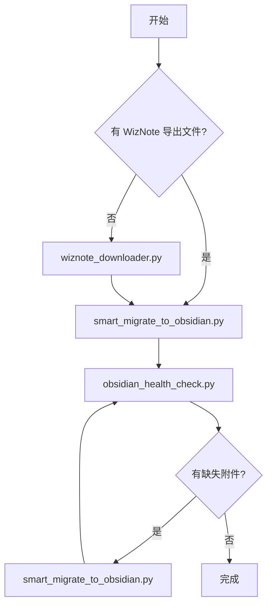

# Tools 目录

> **版本**: v1.2.1 | 所有迁移工具和辅助脚本

## 📁 目录结构

```
tools/
│
│  ── 迁移工具（WizNote → Obsidian）──
│
├── wiznote_downloader.py              # 从 WizNote 云端下载笔记
├── smart_migrate_to_obsidian.py       # 智能迁移工具（推荐）⭐
├── obsidian_formatter.py              # 格式化工具
├── obsidian_health_check.py           # 健康检查工具 ⭐
├── scan_wikilinks.py                  # WikiLink 扫描工具
├── sync_deletions.py                  # 同步删除工具
├── config_helper.py                   # 配置管理模块（被其他工具调用）
│
│  ── 仓库维护（Obsidian 日常清理）──
│
├── consolidate_attachments.py         # 散落资源整合 ⭐
├── vault_cleaner.py                  # 仓库清理（去重 + 近似重复 + 空内容 + 孤儿文件 + 引用修复）⭐
│
│  ── 辅助工具（特定场景）──
│
├── fix_wiznote_source_files.py        # 源文件修复工具（Typora 兼容）
├── integrate_missing_attachments.py   # 整合缺失附件
├── migrate_manual_notes.py            # 手动迁移特定笔记
├── remigrate_single_note.py           # 重新迁移单个笔记
├── move_note_to_correct_path.py       # 移动笔记到正确路径
├── check_attachment_migration.py      # 附件迁移完整性检查
├── check_attachment_migration_fixed.py # 附件迁移检查（修复版）
├── check_attachments_final.py         # 附件完整性最终检查
├── compare_migration.py               # 迁移结果对比
├── diagnose_missing_notes.py          # 缺失笔记诊断
│
└── config.example.json                # 配置文件模板
```

## 🚀 快速开始

### 场景 1：从 WizNote 云端下载并迁移（推荐新手）

```bash
# 1. 从 WizNote 云端下载笔记
python3 tools/wiznote_downloader.py
# 输入 WizNote 账号和密码

# 2. 智能迁移到 Obsidian
python3 tools/smart_migrate_to_obsidian.py
```

### 场景 2：已有 WizNote 导出文件

```bash
# 直接运行智能迁移
python3 tools/smart_migrate_to_obsidian.py
```

### 场景 3：检查仓库健康度

```bash
python3 tools/obsidian_health_check.py
```

### 场景 4：清理 Obsidian 仓库

```bash
# 推荐流程：fix → fuzzy → dedup → orphan → clean

# 1. 修复失效引用
python3 tools/vault_cleaner.py fix /path/to/vault --apply

# 2. 近似重复笔记清理
python3 tools/vault_cleaner.py fuzzy /path/to/vault --apply

# 3. 去重
python3 tools/vault_cleaner.py dedup /path/to/vault --apply

# 4. 清理孤儿文件
python3 tools/vault_cleaner.py orphan /path/to/vault --apply

# 5. 清理空笔记和空目录
python3 tools/vault_cleaner.py clean /path/to/vault --fix-untitled --apply
```

## 🛠️ 核心工具说明

### 迁移工具（WizNote → Obsidian）

#### 1. wiznote_downloader.py（在线下载工具）

**作用**：从 WizNote 云端下载笔记并转换为 Markdown

**使用场景**：还没有导出 WizNote 笔记

**功能**：
- 直接登录 WizNote 云端
- 递归扫描所有文件夹
- 自动转换 HTML → Markdown
- 下载笔记中的图片和附件
- 支持协作笔记下载（通过 WebSocket 协议）

**输出目录**：`wiznote_download/`（原始下载）

**使用方法**：
```bash
python3 tools/wiznote_downloader.py
python3 tools/wiznote_downloader.py --workers 10 --timeout 20
python3 tools/wiznote_downloader.py --workers 3 --timeout 10 --retries 1
```

**支持的笔记类型**：
- ✅ HTML 笔记 - 自动转换为 Markdown
- ✅ Lite/Markdown 笔记 - 直接保存原格式
- ✅ 协作笔记 - 通过 ShareJS 协议自动获取并转换
- ⚠️ 加密笔记 - 检测提醒，需要先在客户端解密
- ✅ 图片/附件 - 下载到 `_files/` 目录

#### 2. smart_migrate_to_obsidian.py（智能迁移工具）⭐ 推荐

**作用**：智能迁移 WizNote 笔记到 Obsidian，支持 WikiLink 格式

**使用场景**：90% 的迁移场景都使用这个工具

**功能**：
- ✅ 自动检测并迁移笔记
- ✅ 支持标准 Markdown 链接和 WikiLink 格式
- ✅ 自动转换 WikiLink → Markdown 链接
- ✅ 迁移所有附件（.xmind, .pdf, .doc 等）
- ✅ 完整性检查和生成报告

**使用方法**：
```bash
python3 tools/smart_migrate_to_obsidian.py
```

#### 3. obsidian_health_check.py（健康检查工具）⭐

**作用**：全面检查 Obsidian 仓库的健康状态

**功能**：
- ✅ 检查附件完整性（图片、PDF、附件）
- ✅ 检查重复内容（文件级别）
- ✅ 检查内容过少的文件
- ✅ 生成健康度评分（0-100）

**使用方法**：
```bash
python3 tools/obsidian_health_check.py
python3 tools/obsidian_health_check.py --quick
```

### 仓库维护工具

#### 4. consolidate_attachments.py（散落资源整合工具）

**作用**：将散落的 `*_files`、`attachments`、`images` 等目录统一归档到顶层 `attachments/`

**使用场景**：Obsidian 仓库中有大量散落的资源目录，侧边栏杂乱

**三种模式**：

| 模式 | 说明 |
|------|------|
| `scan` | 仅扫描并报告散落的资源目录 |
| `dry-run` | 模拟迁移，显示将要执行的操作 |
| `migrate` | 执行迁移：移动文件 → 更新引用 → 清理空目录 |

**使用方法**：
```bash
python3 tools/consolidate_attachments.py scan /path/to/vault
python3 tools/consolidate_attachments.py dry-run /path/to/vault
python3 tools/consolidate_attachments.py migrate /path/to/vault
```

**注意**：迁移后在 Obsidian 设置中配置 `Settings → Files and Links → Default location for new attachments → attachments`。

#### 5. vault_cleaner.py（仓库清理工具）

**作用**：检测并清理重复文件、近似重复笔记、孤儿文件，并修复失效引用

**五种模式**：

| 模式 | 说明 |
|------|------|
| `dedup` | 按内容哈希检测重复文件，每组保留一个，删除其余并更新引用 |
| `fuzzy` | 检测近似重复笔记（按标题+纯文本比对，显示相似度百分比，支持 `--threshold` 调整阈值） |
| `clean` | 检测并清理空笔记和空目录，支持 `--fix-untitled` 清理「无标题」占位符 |
| `orphan` | 检测未被任何笔记引用的资源文件（孤儿文件） |
| `fix` | 修复失效引用，将孤儿文件重新链接到笔记 |

**使用方法**：
```bash
# 修复失效引用
python3 tools/vault_cleaner.py fix /path/to/vault
python3 tools/vault_cleaner.py fix /path/to/vault --apply

# 近似重复笔记清理（带引用重定向）
python3 tools/vault_cleaner.py fuzzy /path/to/vault
python3 tools/vault_cleaner.py fuzzy /path/to/vault --apply
python3 tools/vault_cleaner.py fuzzy /path/to/vault --threshold 0.25 --apply

# 文件去重（带引用更新）
python3 tools/vault_cleaner.py dedup /path/to/vault
python3 tools/vault_cleaner.py dedup /path/to/vault --apply

# 孤儿文件清理（默认排除 .pdf .xls .xlsx .xmind）
python3 tools/vault_cleaner.py orphan /path/to/vault
python3 tools/vault_cleaner.py orphan /path/to/vault --apply

# 清理空笔记和空目录
python3 tools/vault_cleaner.py clean /path/to/vault
python3 tools/vault_cleaner.py clean /path/to/vault --fix-untitled --apply
```

**推荐流程**：`fix` → `fuzzy` → `dedup` → `orphan` → `clean`

**模板保护**：文件名含 `template`、`模板`、`tpl` 的笔记不会被 fuzzy 删除。

**引用安全**：
- `dedup`：删除前更新所有指向被删文件的引用（Markdown/WikiLink/HTML）
- `fuzzy`：删除前把 `[[被删笔记标题]]` 重定向到保留笔记
- `orphan`：按绝对路径+文件名双重匹配，仅删除真正无引用的文件

**默认排除**：`orphan` 模式默认排除 `.pdf`、`.xls`、`.xlsx`、`.xmind`，可通过 `--exclude-ext` 自定义。

**配置**：清理相关的目录名、排除扩展名、模板保护关键词可通过 `config.json` 的 `cleanup` 节点配置。

### 辅助工具说明

#### 6. fix_wiznote_source_files.py

**作用**：修复 WizNote 源文件中的 WikiLink，转换为标准 Markdown 格式

**使用场景**：确保源文件在 Typora 等标准 Markdown 编辑器中正常显示

```bash
python3 tools/fix_wiznote_source_files.py
```

#### 7. integrate_missing_attachments.py

**作用**：将"缺失图片及附件笔记"目录中的笔记和附件整合到主目录

```bash
python3 tools/integrate_missing_attachments.py
```

#### 8. migrate_manual_notes.py

**作用**：手动迁移特定笔记

#### 9. remigrate_single_note.py

**作用**：重新迁移单个笔记

#### 10. move_note_to_correct_path.py

**作用**：移动笔记到正确的路径

#### 11-15. 迁移检查工具

```bash
python3 tools/check_attachment_migration.py --help
python3 tools/check_attachments_final.py --help
python3 tools/compare_migration.py --help
python3 tools/diagnose_missing_notes.py --help
```

#### 16. config_helper.py

**作用**：配置管理模块（被其他工具调用，不需要直接运行）

## ⚙️ 配置说明

### 方式 1：环境变量（推荐）

```bash
export WIZNOTE_SOURCE_DIR=wiznote_download
export WIZNOTE_VAULT_DIR=wiznote_obsidian
export WIZNOTE_ATTACHMENTS_DIR=wiznote_obsidian/attachments
```

### 方式 2：配置文件

```bash
cp config.example.json config.json
python3 tools/smart_migrate_to_obsidian.py --config config.json
```

`config.json` 支持的配置节：
- `source_dir` / `vault_dir` / `target_dir` — 迁移路径
- `categories` — 笔记分类和标签
- `cleanup` — 清理工具配置（资源目录名、排除扩展名、模板保护等）

## 🔄 工作流程

### 完整迁移流程



## 💡 最佳实践

1. **首次迁移**：
   - 使用 `wiznote_downloader.py` 下载笔记
   - 使用 `fix_wiznote_source_files.py` 修复源文件
   - 使用 `smart_migrate_to_obsidian.py` 迁移到 Obsidian
   - 使用 `obsidian_health_check.py` 验证

2. **定期检查**：
   - 定期运行 `obsidian_health_check.py` 检查仓库健康度

3. **清理仓库**：
   - 先 `consolidate_attachments.py` 整合散落资源
   - 再 `vault_cleaner.py` 按流程清理

## 📊 工具对比

| 功能 | wiznote_downloader | smart_migrate | obsidian_formatter | health_check | consolidate | vault_cleaner |
|------|-------------------|---------------|-------------------|--------------|-------------|---------------|
| 下载笔记 | ✅ | ❌ | ❌ | ❌ | ❌ | ❌ |
| 迁移笔记 | ❌ | ✅ | ✅ | ❌ | ❌ | ❌ |
| 检查附件 | ❌ | ✅ | ❌ | ✅ | ❌ | ❌ |
| 去重 | ❌ | ❌ | ❌ | ❌ | ❌ | ✅ |
| 近似重复 | ❌ | ❌ | ❌ | ❌ | ❌ | ✅ |
| 整合资源 | ❌ | ❌ | ❌ | ❌ | ✅ | ❌ |
| 生成报告 | ✅ | ✅ | ✅ | ✅ | ✅ | ✅ |
